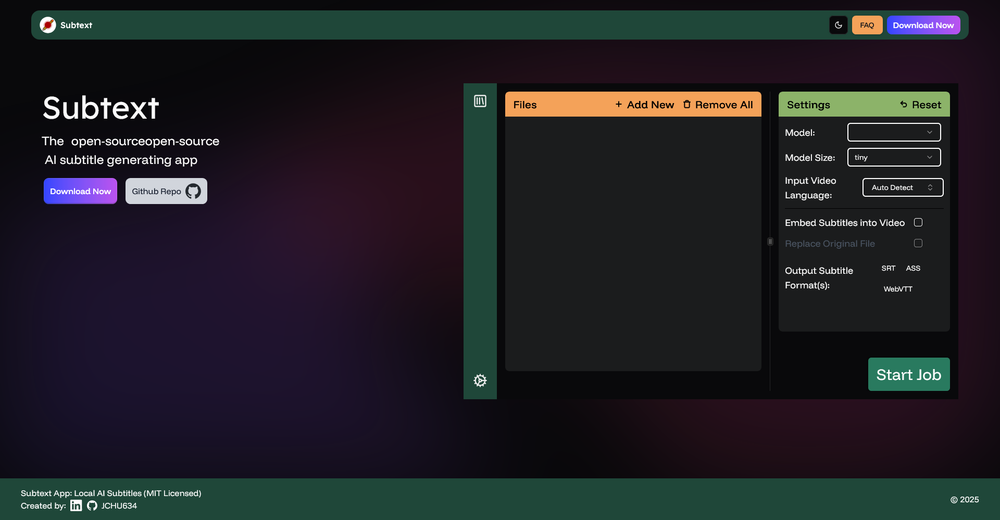

# Subtext
This repo is the source code for the subtext website.\
If you are here for the app instead, it is located at [github.com/jchu634/subtextapp](https://github.com/jchu634/subtextapp).



### Built Using
<a href="https://astro.build/">
    
</a>
<a href="https://nextjs.org/">
     
</a>
<a href="https://tailwindcss.com/">
     
</a>
<a href="https://motion.dev/">
     
</a>


### Install Instructions

```sh
npm install
npm run dev
```
